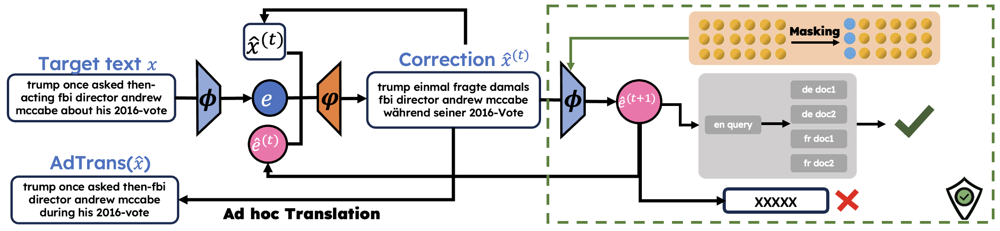

# Multilingual Vec2Text 

Multilingual Vec2Text supports research in Text Embedding Inversion Security in Language Models, extending Jack Morris' [Vec2Text](https://github.com/jxmorris12/vec2text) with __Ad-hoc Translation__ and __Masking Defense Mechanism__. We investigate throughly multilingual and crosslingual text reconstructions, and potential defense mechanisms.

The tutorials for setting up experiments on supercomputer nodes such as __[LUMI](https://docs.lumi-supercomputer.eu/)__ is in Wiki pages. 
All the scripts for running experiments are provided in the GitHub repository. 

