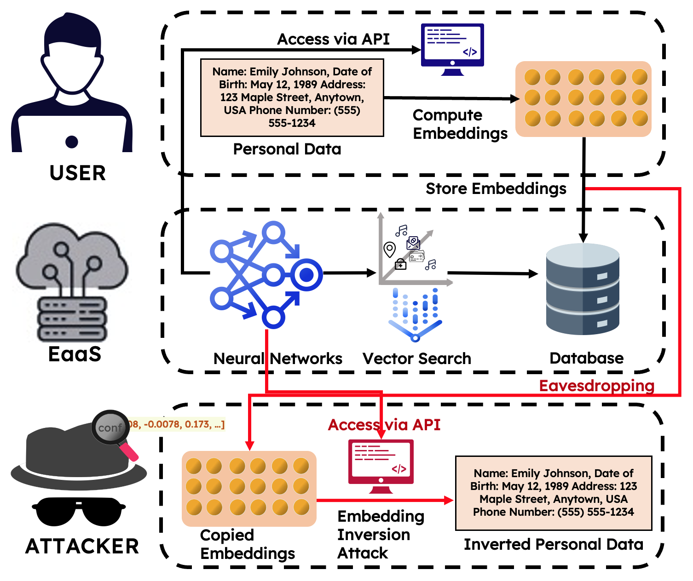
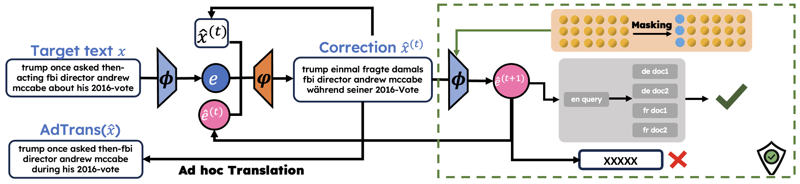
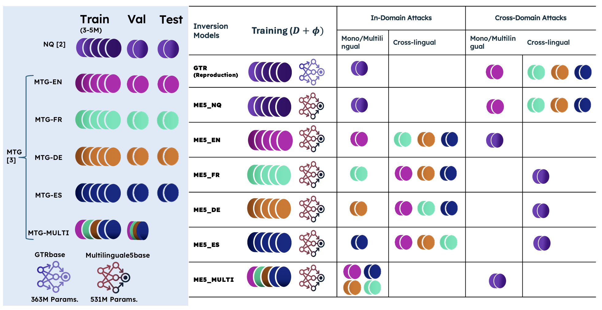

# Text Embedding Inversion Attacks on Multilingual Language Models

* Schematic Overview of a Text Embedding Inversion Attack.


Multilingual Vec2Text supports research in Text Embedding Inversion Security in Language Models, 
extending Jack Morris' [Vec2Text](https://github.com/jxmorris12/vec2text) with __Ad-hoc Translation__ and __Masking Defense Mechanism__. 
We investigate thoroughly multilingual and cross-lingual text inversion attacks, 
and defense mechanisms. This repository contains code for the __ACL 2024__ long paper [Text Embedding Inversion Attacks on Multilingual Language Models
](https://arxiv.org/abs/2401.12192).
The poster is [online](multilingual_text2vec_poster.pdf).


All the trained inversion models are on [Huggingface](https://huggingface.co/yiyic).
All the models are trained with [T5-base](https://huggingface.co/google-t5/t5-base) as the external encoder-decoder.


Black-box Encoder | Training Data        | Base Model | Corrector Model
--- |----------------------| --- | ---
[GTR-base](https://huggingface.co/sentence-transformers/gtr-t5-base) | 5M Natural Questions | [yiyic/t5_gtr_base_nq_32_inverter](https://huggingface.co/yiyic/t5_gtr_base_nq_32_inverter) | [yiyic/t5_gtr_base_nq_32_corrector](https://huggingface.co/yiyic/t5_gtr_base_nq_32_corrector) 
[ME5-base](https://huggingface.co/intfloat/multilingual-e5-base) | 5M Natural Questions | [yiyic/t5_me5_base_nq_32_inverter](https://huggingface.co/yiyic/t5_me5_base_nq_32_inverter) | [yiyic/t5_me5_base_nq_32_corrector](https://huggingface.co/yiyic/t5_me5_base_nq_32_corrector)
[ME5-base](https://huggingface.co/intfloat/multilingual-e5-base) | 5M MTG Spanish       | [yiyic/t5_me5_base_mtg_es_5m_32_inverter](https://huggingface.co/yiyic/t5_me5_base_mtg_es_5m_32_inverter) | [yiyic/t5_me5_base_mtg_es_5m_32_corrector](https://huggingface.co/yiyic/t5_me5_base_mtg_es_5m_32_corrector)
[ME5-base](https://huggingface.co/intfloat/multilingual-e5-base) | 5M MTG French        | [yiyic/t5_me5_base_mtg_fr_5m_32_inverter](https://huggingface.co/yiyic/t5_me5_base_mtg_fr_5m_32_inverter) | [yiyic/t5_me5_base_mtg_fr_5m_32_corrector](https://huggingface.co/yiyic/t5_me5_base_mtg_fr_5m_32_corrector)
[ME5-base](https://huggingface.co/intfloat/multilingual-e5-base) | 5M MTG German        | [yiyic/t5_me5_base_mtg_de_5m_32_inverter](https://huggingface.co/yiyic/t5_me5_base_mtg_de_5m_32_inverter) | [yiyic/t5_me5_base_mtg_de_5m_32_corrector](https://huggingface.co/yiyic/t5_me5_base_mtg_de_5m_32_corrector)
[ME5-base](https://huggingface.co/intfloat/multilingual-e5-base) | 5M MTG English       | [yiyic/t5_me5_base_mtg_en_5m_32_inverter](https://huggingface.co/yiyic/t5_me5_base_mtg_en_5m_32_inverter) | [yiyic/t5_me5_base_mtg_en_5m_32_corrector](https://huggingface.co/yiyic/t5_me5_base_mtg_en_5m_32_corrector)
[ME5-base](https://huggingface.co/intfloat/multilingual-e5-base) | 5M MTG Multilingual  | [yiyic/t5_me5_base_mtg_en_fr_de_es_5m_32_inverter](https://huggingface.co/yiyic/t5_me5_base_mtg_en_fr_de_es_5m_32_inverter) | [yiyic/t5_me5_base_mtg_en_fr_de_es_5m_32_corrector](https://huggingface.co/yiyic/t5_me5_base_mtg_en_fr_de_es_5m_32_corrector)


[//]: # (There is documentation of the extended functions and features of this repository compared to `Vec2Text`,)

[//]: # (see [documentation]&#40;https://github.com/siebeniris/MultiVec2Text/wiki/New-Functions-and-Features,-extended-upon-Vec2Text&#41;,)

[//]: # (which is under continuous maintenace.)


* Overview of Multilingual Vec2Text.



The tutorials for setting up experiments on supercomputer nodes such as __[LUMI](https://docs.lumi-supercomputer.eu/)__ will be in Wiki pages. 
All the scripts for running experiments _will be_ provided in the GitHub repository. 
GitHub is still under construction.

## Experiments (Inversion attack simulations)



## Setup
1. download the release from [releases](https://github.com/siebeniris/MultiVec2Text/tags) and unzip.
2. `pip install -r requirements.txt`
3. donwload `punkt` package from `nltk`
```
import nltk
nltk.download("punkt")
```


## Text Embedding Examples
Usage in [interactive environment in a server](https://github.com/siebeniris/MultiVec2Text/wiki/Sample-Evaluation-in-an-Interactive-Environment)


```

from eval_samples import * 

model_path="yiyic/t5_me5_base_mtg_en_fr_de_es_5m_32_corrector"

samples = ["jack morris is a phd student at cornell tech in new york city",
"it was the best of times, it was the worst of times, it was the age of wisdom",
"in einer stunde erreichen wir kopenhagen."., 
"comment puis-je vous aider?"
]

experiment, trainer = analyze_utils.load_experiment_and_trainer_from_pretrained(
        model_path, use_less_data=3000)

trainer, device = trainer_attributes(trainer, experiment)
trainer.num_gen_recursive_steps = 10
# set sbeam
# trainer.sequence_beam_width = xx

evaluate_samples(trainer, device, samples)

```

output:

```

[pred] jack morris is a phd student at cornell tech in new york city
[true] jack morris is a phd student at cornell tech in new york city


[pred] it was the best of times, it was the worst of times, it was the age of wisdom
[true] it was the best of times, it was the worst of times, it was the age of wisdom


[pred] in einer stunde erreichen wir kopenhagen.
[true] in einer stunde erreichen wir kopenhagen.


[pred] comment puis-je vous aider?
[true] comment puis-je vous aider?

```


## Ad-Hoc Translation (AdTrans)
The codes for AdTrans evaluation is in `adTrans`.

* translate the $\hat{x}$ from training language to target language and evaluate.

```
python adTrans/translate_test_results.py $results_output_directory$
python adTrans/eval.py $results_output_directory$ 
python adTrans/eval_sum_up.py $results_output_directory$
```


__Inversion Models Limitations__
- To analyze the impact of multilingual parallel data training, 
we used [MTG](https://aclanthology.org/2022.findings-naacl.192/) benchmark in English, French, German, and Spanish, 
the texts in the datasets were given as lower-cased, so our trained inversion `ME5-based` models
work mostly for lower-cased texts as well. 
Along with dataset limitation, the best performing models invert sentences within the length of 32 tokens.
We will address these limitation for future work.


## Cite our Paper 

```
@article{chen2024text,
  title={Text Embedding Inversion Attacks on Multilingual Language Models},
  author={Chen, Yiyi and Lent, Heather and Bjerva, Johannes},
  journal={arXiv preprint arXiv:2401.12192},
  year={2024}
}
```


